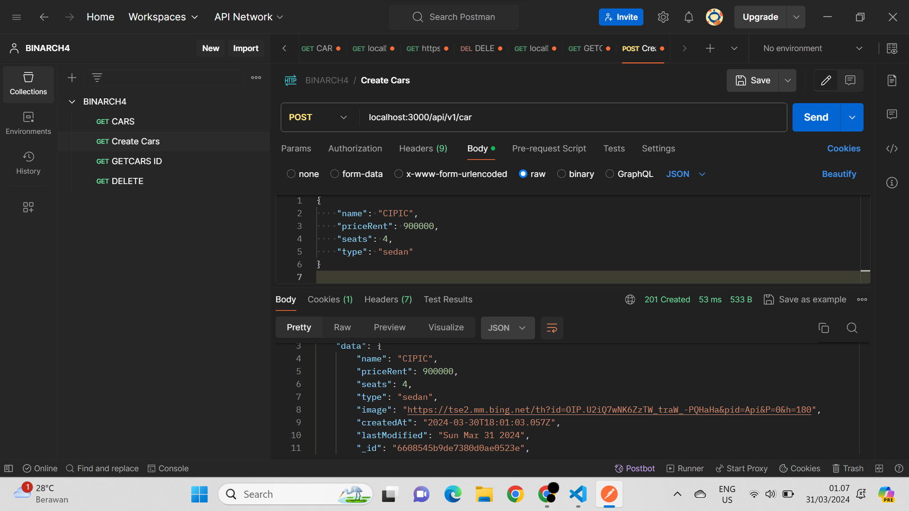

### 1. Cars Dashboard
 Database Diagram

ini merupakan database diagram dari challenge Gold chapter 4 Car Management Dashboard :
## Table Diagram

<!--  -->
<h1 align="center">
  
</h1>

### 2. Port
### jalan diport localhost:3000/

### 3. API WEB PAGE
3.1. View web Page

- /dashboard/ = get all cars page

- /dashboard/create (GET) = ini halaman untuk create new car

- /dashboard/create (POST) = ini api action untuk create new car

- /dashboard/edit?id= ID_Data (GET) = ini halaman untuk edit car

- /dashboard/edit?id= ID_Data (POST) = ini halaman setelah selesai edit

- /dashboard/delete/ ID_Data (GET) = ini api action untuk delete car

### 3.2 API BACKEND POSTMAN

3.2 View car Postman & browser
- localhost:/api/v1/car (GET) = ini untuk melihat json filenya dibrowser dan menampilkan juga dipostman

- localhost:/api/v1/car (POST) = ini untuk membuat new car

- localhost:/api/v1/car/:id (PATCH) = Ini untuk update by id

- localhost:/api/v1/car/:id (GET) = mendapatkan car by id

- localhost:/api/v1/car/:id (DELETE) = hapus car didalam

### 4. CAR DOCS

### 4.1. Get all Cars

### 4.2. Get create Car

### 4.3. Get Car byid Car

### 4.4. Update byid Car

### 4.5. Dele Car byid Car

- ........................
